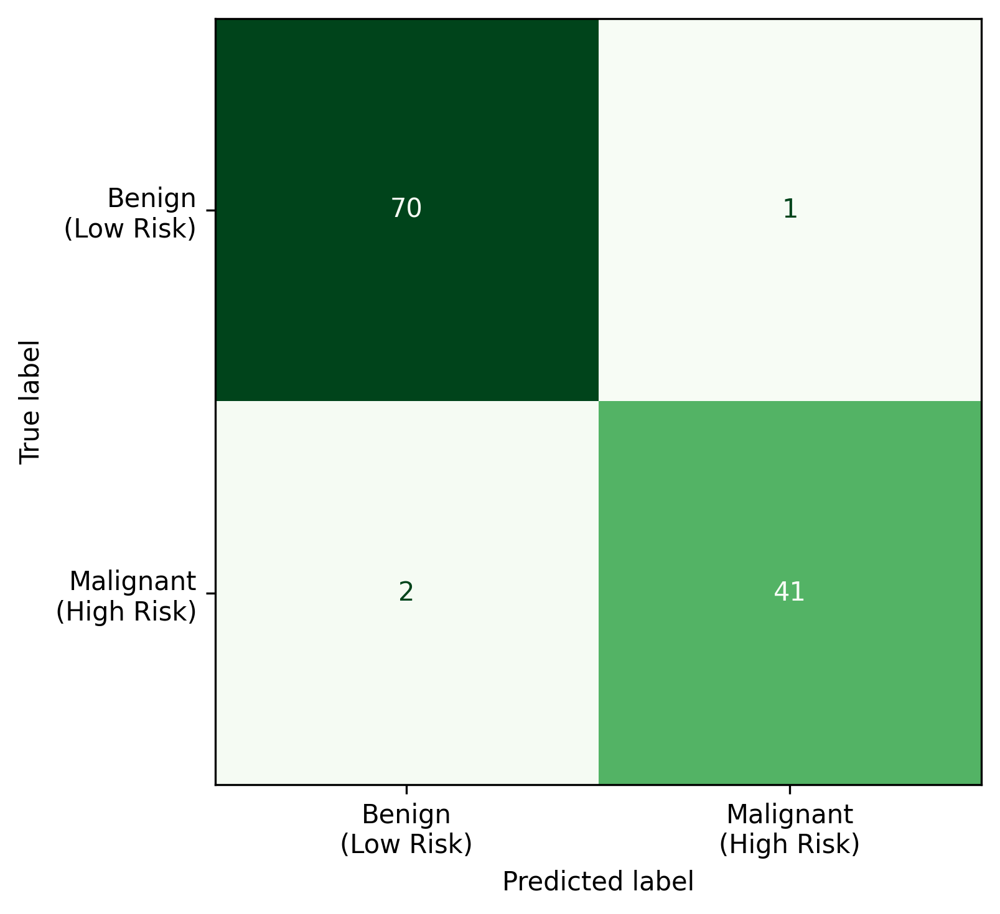
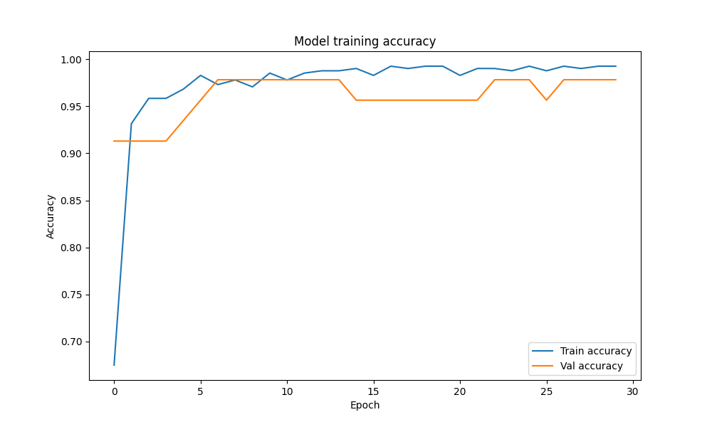
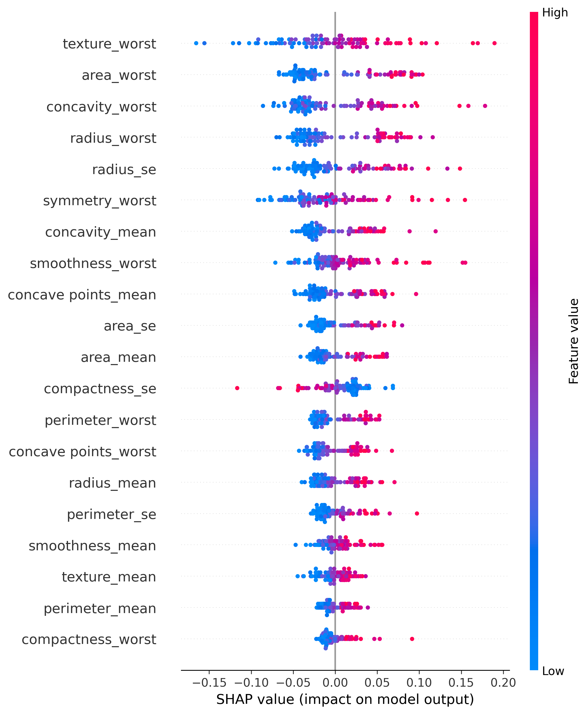

# Neural Network Classification with TensorFlow / Keras

Deep Learning binary classification project built with TensorFlow/Keras.

## Technologies

- Python 3.10
- TensorFlow 2.x
- Keras
- Scikit-Learn
- SHAP
- Pandas
- NumPy
- Matplotlib

## Implemented

- Data preprocessing
  - Label Encoding
  - Standard Scaling
  - Train/Test Split

- Neural Network Architecture
  - Dense Layers
  - ReLU Activation
  - Dropout Regularization
  - Sigmoid Output Layer

- Model Training
  - Adam Optimizer
  - Binary Crossentropy Loss
  - Validation Split

- Model Evaluation
  - Classification Report
  - Confusion Matrix
  - Accuracy Tracking

- Explainable AI (XAI)
  - SHAP Feature Importance
  - SHAP Summary Plot

## Architecture

```text
Input
 ├─ Dense(256, ReLU)
 ├─ Dropout(0.4)
 ├─ Dense(128, ReLU)
 ├─ Dropout(0.3)
 ├─ Dense(64, ReLU)
 ├─ Dropout(0.2)
 └─ Dense(1, Sigmoid)
```

## Visualizations

### Confusion Matrix



### Training Accuracy



### SHAP Summary Plot



## Project Structure

```text
.
├── data/
│   └── diagnostic_measurements.csv
├── figures/
├── src/
│   └── deep_learning_classification.py
├── requirements.txt
└── README.md
```

## Installation

```bash
git clone https://github.com/karolinasniezek/deep-learning-keras.git
cd deep-learning-keras

python3.10 -m venv .venv
source .venv/bin/activate

pip install -r requirements.txt
```

## Run

```bash
python src/deep_learning_classification.py
```
